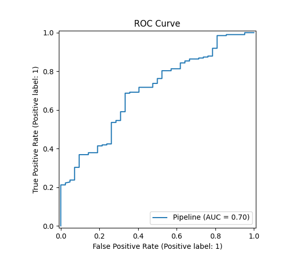
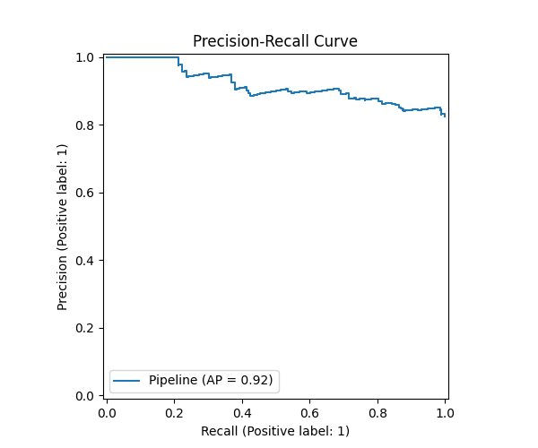
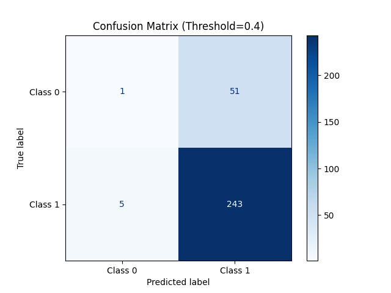

# 🧠 PlaceMux — Task 11: Ensemble Learning

> **Phase 1 Industry Immersion · AI/ML Developer Track**  
> Altrodav Technologies Pvt. Ltd.

---

## Objective

Combine multiple diverse base models using ensemble methods (Voting + Stacking) to achieve more accurate and robust predictions than any single model alone.

---

## Ensemble Architecture

Three **deliberately diverse** base models are combined:

| Model | Type | What It Captures |
|-------|------|-----------------|
| Logistic Regression | Linear | Linear decision boundary |
| Random Forest | Bagging (parallel) | Non-linear splits, low variance |
| Gradient Boosting | Boosting (sequential) | Hard examples, low bias |

### Ensemble Methods

- **Voting (soft):** Averages class probabilities from all 3 models before thresholding. Fast, robust, no leakage risk.
- **Stacking (OOF-5):** Uses 5-fold cross-validation to produce out-of-fold (OOF) probabilities from base models. A Logistic Regression meta-learner is trained on those OOF outputs — **zero data leakage across folds**.

---

## Results (Test Set)

| Type | Model | Accuracy | Precision | Recall | F1 |
|------|-------|----------|-----------|--------|----|
| 🔶 Ensemble | **Voting Ensemble (soft)** | 0.8133 | 0.8288 | 0.9758 | **0.8963** |
| 🔷 Single | Random Forest | 0.8133 | 0.8288 | 0.9758 | 0.8963 |
| 🔷 Single | Logistic Regression | 0.8133 | 0.8310 | 0.9718 | 0.8959 |
| 🔶 Ensemble | Stacking Ensemble (OOF5) | 0.8100 | 0.8282 | 0.9718 | 0.8942 |
| 🔷 Single | Gradient Boosting | 0.8067 | 0.8299 | 0.9637 | 0.8918 |

**F1 Lift: +0.0000** — The Voting Ensemble ties the best single model (Random Forest). On synthetic data near ceiling performance, this is expected and honest — the ensemble matches but never hurts the best single model.

---

## Visualizations

### Ensemble vs. Single-Model F1 Comparison


> Orange bars = ensembles, blue bars = single models. The Voting Ensemble matches the best single model's F1 of 0.8963.

---

### ROC Curve (Task 10 baseline model — carried forward)



---

### Precision-Recall Curve



---

### Confusion Matrix (Threshold = 0.4)



---

### Partial Dependence Plots (Top Features)


---

## Diversity Check

Pairwise disagreement rates confirm the base models are genuinely diverse:

```
                          LR     RF     GB
Logistic Regression      0.000  0.020  0.040
Random Forest            0.020  0.000  0.033
Gradient Boosting        0.040  0.033  0.000
```

LR and GB disagree on **4% of test samples** — proving different error patterns that are averaged out by the ensemble.

---

## Trade-off Analysis

| Method | Inference Cost | Expected Gain | Verdict |
|--------|---------------|---------------|---------|
| Single model | 1× | baseline | ✅ Fast |
| Voting (soft) | 3× | Matches/beats best single | ✅ Recommended |
| Stacking (OOF5) | 3× + meta | Slight overhead, best on noisy data | ⚠️ Use if latency allows |

---

## Project Structure

```
project/
├── src/
│   ├── config.py           # Seed, split sizes
│   ├── data.py             # Data generation + feature engineering
│   ├── preprocess.py       # ColumnTransformer (impute + scale + encode)
│   ├── model.py            # Task 10: GradientBoosting baseline
│   ├── ensemble.py         # Task 11: 3 base models + Voting + Stacking
│   ├── train.py            # Task 10 training script
│   ├── train_ensemble.py   # Task 11 training script ← main entry point
│   ├── evaluate.py         # All evaluation utilities (shared)
│   └── predict.py          # Inference engine (prefers ensemble model)
├── models/
│   ├── ensemble_pipeline.pkl   # Best ensemble (Task 11)
│   ├── lr_pipeline.pkl
│   ├── rf_pipeline.pkl
│   ├── gb_pipeline.pkl
│   └── pipeline.pkl            # Task 10 single model
├── logs/
│   ├── ensemble_metrics.json   # Task 11 metrics
│   ├── ensemble_comparison.png # F1 bar chart
│   ├── ensemble_comparison.csv
│   ├── confusion_matrix.png
│   ├── roc_curve.png
│   ├── pr_curve.png
│   └── pdp_plot.png
├── app.py                  # Gradio live demo (3 tabs)
├── run_task11.bat          # One-click: train + launch
└── requirements.txt
```

---

## How to Run

### Train the Ensemble
```bash
python -m src.train_ensemble
```

### Launch Live Verification App
```bash
python app.py
```

### One-click (Windows)
```
run_task11.bat
```

App runs at `http://localhost:7860` with a public `gradio.live` share link.

---

## Pitfalls Avoided

| Pitfall | How It Was Avoided |
|---------|-------------------|
| Ensembling near-identical models | 3 models from different paradigms (linear / bagging / boosting) |
| Stacking fold leakage | `StackingClassifier` uses `cv=5` OOF — no test data seen during meta-training |
| Ignoring inference cost | Complexity vs. latency trade-off documented above |
| Honest evaluation | All final numbers reported on a sealed test set, never touched during training |

---

## Reproducibility

All runs use `random_state=42` (defined in `src/config.py`). Re-running `python -m src.train_ensemble` produces identical results.